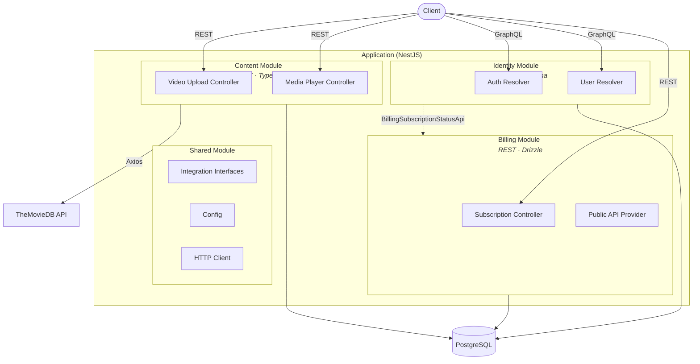
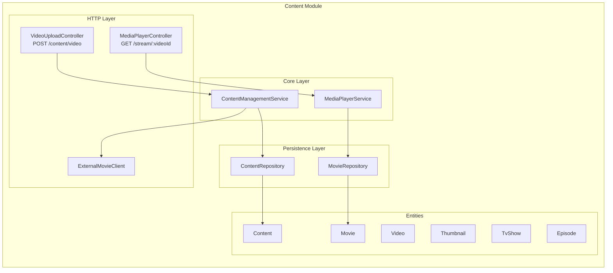
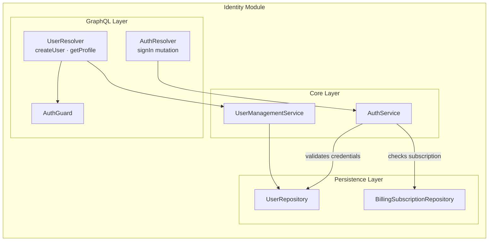
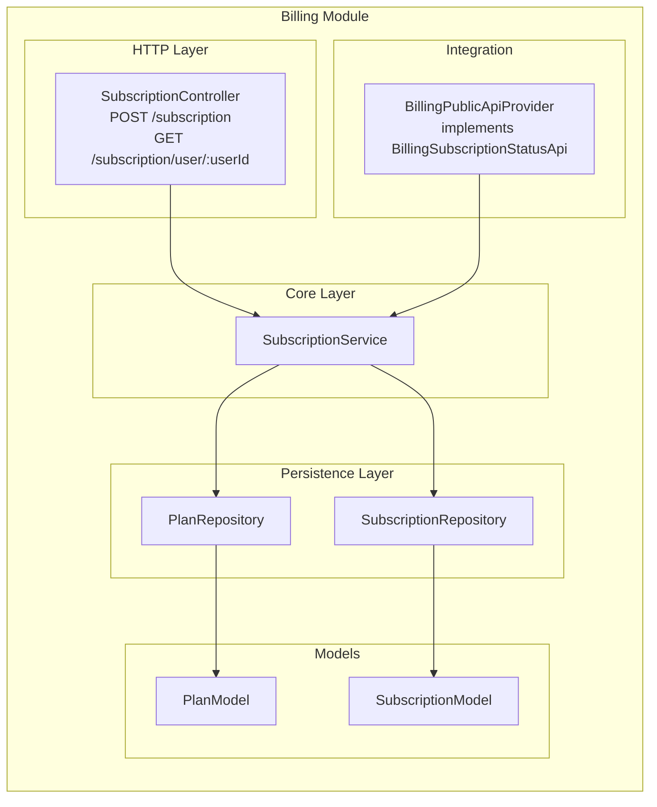
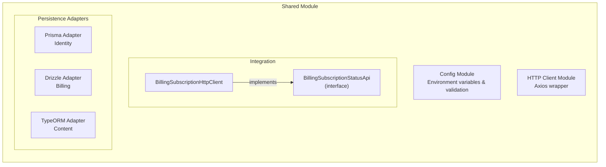
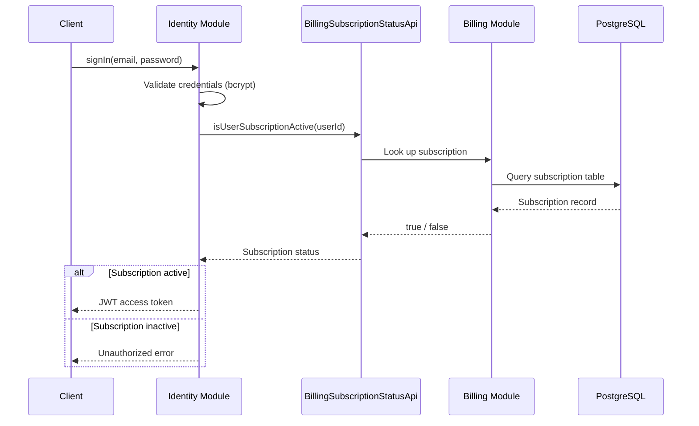
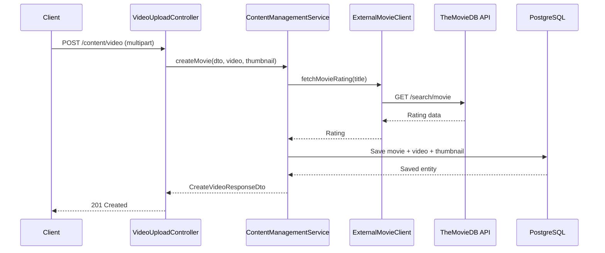
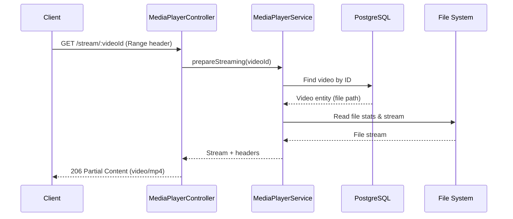
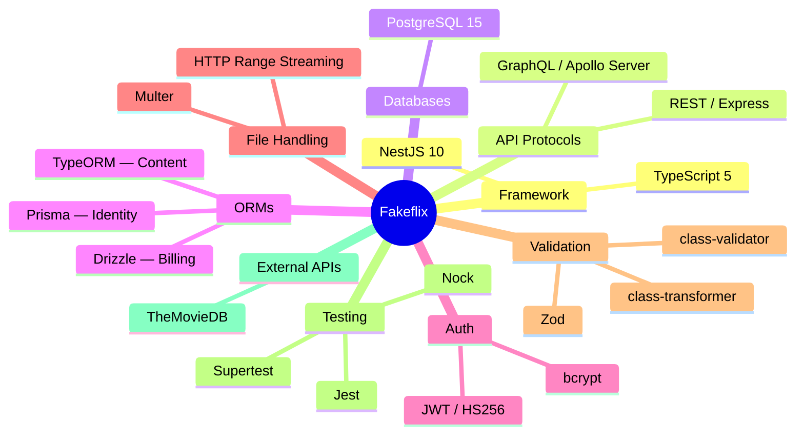

# Fakeflix — Modular Architecture Lab

A **modular monolith** backend for a video streaming platform, built with [NestJS](https://nestjs.com/). This project demonstrates enterprise-level modular architecture with strict module boundaries, multiple ORM strategies, and mixed API protocols (REST + GraphQL).

## Table of Contents

- [Overview](#overview)
- [High-Level Architecture](#high-level-architecture)
- [Module Details](#module-details)
  - [Content Module](#content-module)
  - [Identity Module](#identity-module)
  - [Billing Module](#billing-module)
  - [Shared Module](#shared-module)
- [Inter-Module Communication](#inter-module-communication)
- [Data Flow](#data-flow)
- [Technology Stack](#technology-stack)
- [Project Structure](#project-structure)
- [API Reference](#api-reference)
- [Getting Started](#getting-started)
- [Database Migrations](#database-migrations)
- [Testing](#testing)

---

## Overview

Fakeflix is a streaming platform backend composed of three independent domain modules — **Content**, **Identity**, and **Billing** — each owning its own data layer and API protocol. The modules communicate through well-defined integration interfaces, keeping coupling to a minimum while running inside a single deployable unit.

---

## High-Level Architecture



---

## Module Details

### Content Module

Manages the video content lifecycle — upload, metadata enrichment, and streaming.



| Aspect | Details |
|--------|---------|
| **Protocol** | REST (Express) |
| **ORM** | TypeORM |
| **Endpoints** | `POST /content/video` · `GET /stream/:videoId` |
| **File Upload** | Multer — video (MP4, up to 1 GB) and thumbnail (JPEG, up to 10 MB) |
| **Streaming** | HTTP 206 Partial Content with range header support |
| **External API** | TheMovieDB for movie ratings |

---

### Identity Module

Handles user authentication (JWT), user registration, and profile management.



| Aspect | Details |
|--------|---------|
| **Protocol** | GraphQL (Apollo Server) |
| **ORM** | Prisma |
| **Operations** | `signIn` mutation · `createUser` mutation · `getProfile` query |
| **Authentication** | JWT (HS256, 60-min expiry) with bcrypt password hashing |
| **Integration** | Calls Billing module to verify active subscription on sign-in |

---

### Billing Module

Manages subscription plans and the subscription lifecycle.



| Aspect | Details |
|--------|---------|
| **Protocol** | REST (Express) |
| **ORM** | Drizzle |
| **Endpoints** | `POST /subscription` · `GET /subscription/user/:userId` |
| **Features** | Monthly / Yearly billing intervals · Trial periods · Auto-renewal · Status tracking (Active / Inactive) |
| **Public API** | Exposes `BillingPublicApiProvider` for inter-module subscription checks |

---

### Shared Module

Provides cross-cutting infrastructure used by all domain modules.



---

## Inter-Module Communication

Modules interact through **interface-based integration**, keeping dependencies inverted and coupling minimal.



---

## Data Flow

### Video Upload Flow



### Video Streaming Flow



---

## Technology Stack



| Category | Technology | Used By |
|----------|-----------|---------|
| **Framework** | NestJS 10, TypeScript 5 | All modules |
| **REST API** | Express | Content, Billing |
| **GraphQL** | Apollo Server | Identity |
| **ORM** | TypeORM | Content |
| **ORM** | Prisma | Identity |
| **ORM** | Drizzle | Billing |
| **Database** | PostgreSQL 15 | All modules |
| **Authentication** | JWT (HS256), bcrypt | Identity |
| **File Upload** | Multer | Content |
| **HTTP Client** | Axios | Content (TheMovieDB) |
| **Validation** | class-validator, Zod | All modules |
| **Testing** | Jest, Supertest, Nock | All modules |

---

## Project Structure

```
├── src/
│   ├── main.ts                          # Application entry point (port 3000)
│   ├── app.module.ts                    # Root module (imports Content & Identity)
│   └── module/
│       ├── billing/                     # Billing domain module
│       │   ├── core/model/              #   Domain models (Plan, Subscription)
│       │   ├── core/service/            #   SubscriptionService
│       │   ├── http/rest/controller/    #   REST endpoints
│       │   ├── http/rest/dto/           #   Request / Response DTOs
│       │   ├── integration/provider/    #   BillingPublicApiProvider
│       │   ├── persistence/             #   Drizzle repositories & schema
│       │   └── billing.module.ts
│       ├── content/                     # Content domain module
│       │   ├── core/service/            #   ContentManagement & MediaPlayer services
│       │   ├── http/rest/controller/    #   REST endpoints (upload, stream)
│       │   ├── http/rest/client/        #   ExternalMovieClient (TheMovieDB)
│       │   ├── persistence/entity/      #   TypeORM entities
│       │   ├── persistence/repository/  #   TypeORM repositories
│       │   └── content.module.ts
│       ├── identity/                    # Identity domain module
│       │   ├── core/service/            #   AuthService & UserManagementService
│       │   ├── http/graphql/            #   GraphQL resolvers & types
│       │   ├── http/guard/              #   JWT AuthGuard
│       │   ├── persistence/repository/  #   Prisma repositories
│       │   └── identity.module.ts
│       └── shared/                      # Shared infrastructure
│           ├── core/                    #   Base models & exceptions
│           └── module/
│               ├── config/              #   Environment configuration
│               ├── http-client/         #   Axios HTTP client
│               ├── integration/         #   Inter-module interfaces & clients
│               └── persistence/         #   ORM adapters (Prisma, Drizzle, TypeORM)
├── database/
│   ├── billing/drizzle/                 # Drizzle migrations
│   ├── content/typeorm/                 # TypeORM migrations
│   └── identity/prisma/                 # Prisma schema & migrations
├── test/                                # E2E test infrastructure
├── docker-compose.yml                   # PostgreSQL container
├── .env.default                         # Environment variable template
└── tsconfig.json                        # TypeScript config with path aliases
```

---

## API Reference

### Content Module (REST)

| Method | Endpoint | Description |
|--------|----------|-------------|
| `POST` | `/content/video` | Upload a video with thumbnail (multipart form) |
| `GET` | `/stream/:videoId` | Stream a video (supports HTTP range requests) |

### Identity Module (GraphQL)

| Operation | Name | Description |
|-----------|------|-------------|
| Mutation | `signIn(email, password)` | Authenticate and receive a JWT token |
| Mutation | `createUser(input)` | Register a new user |
| Query | `getProfile` | Get the authenticated user's profile (requires JWT) |

### Billing Module (REST)

| Method | Endpoint | Description |
|--------|----------|-------------|
| `POST` | `/subscription` | Create a new subscription |
| `GET` | `/subscription/user/:userId` | Get a user's subscription details |

---

## Getting Started

### Prerequisites

- **Node.js** ≥ 18
- **Yarn** (or npm)
- **Docker** (for PostgreSQL)

### 1. Clone the repository

```bash
git clone https://github.com/ElJohnnie/modular-architecture-lab.git
cd modular-architecture-lab
```

### 2. Install dependencies

```bash
yarn install
```

### 3. Start the database

```bash
docker compose up -d
```

### 4. Configure environment variables

```bash
cp .env.default .env
```

Edit `.env` as needed. Key variables:

| Variable | Default | Description |
|----------|---------|-------------|
| `DATABASE_HOST` | `localhost` | PostgreSQL host |
| `DATABASE_PORT` | `5432` | PostgreSQL port |
| `DATABASE_USERNAME` | `postgres` | Database user |
| `DATABASE_PASSWORD` | `postgres` | Database password |
| `DATABASE_NAME` | `fakeflix` | Database name |
| `BILLING_API_URL` | `https://localhost:3000` | Billing module URL |
| `MOVIEDB_API_TOKEN` | — | TheMovieDB API token |
| `MOVIEDB_BASE_URL` | `https://api.themoviedb.org/3` | TheMovieDB base URL |

### 5. Run database migrations

```bash
# Content module (TypeORM)
yarn content:db:migrate

# Identity module (Prisma)
yarn identity:db:migrate

# Billing module (Drizzle)
yarn billing:db:migrate
```

### 6. Start the application

```bash
# Development (watch mode)
yarn start:dev

# Production
yarn build && yarn start:prod
```

The server starts on **http://localhost:3000**. The GraphQL Playground is available at **http://localhost:3000/graphql**.

---

## Database Migrations

Each module owns its migrations independently:

| Module | ORM | Commands |
|--------|-----|----------|
| **Content** | TypeORM | `yarn content:db:generate` · `yarn content:db:migrate` · `yarn content:db:drop` |
| **Identity** | Prisma | `yarn identity:db:generate` · `yarn identity:db:migrate` |
| **Billing** | Drizzle | `yarn billing:db:generate` · `yarn billing:db:migrate` · `yarn billing:db:push` · `yarn billing:db:drop` |

---

## Testing

```bash
# Unit tests
yarn test

# E2E tests
yarn test:e2e

# Test coverage
yarn test:cov
```

E2E tests are located inside each module's `__test__/e2e/` directory and use the shared test infrastructure under `test/`.
